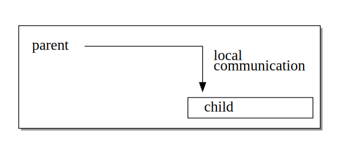
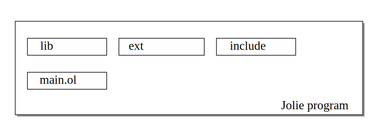
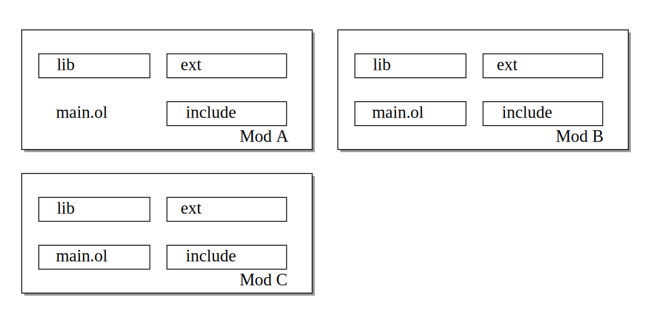

class: center, middle, inverse

# Packaging Microservices

Dan Sebastian Thrane [&lt;dthrane@gmail.com&gt;](mailto:dthrane@gmail.com)

Fabrizio Montesi [&lt;fmontesi@imada.sdu.dk&gt;](mailto:fmontesi@imada.sdu.dk)

.right.logo[

]

???

Mention up here roughly what we will be doing, that way we can jump straight
into talking about microservices.

---

.left-column[
## MSA
]

.right-column[
MicroService Architectures (MSA) are composed of _services_

.p85.center[]

Each service is _autonomous_ and _reusable_
]

--

.right-column[
Communication via message passing.

.p85.center[]
]

???

Microservices are a paradigm where every component is a service. These
individual services are entirely autonomous and reusable. Microservices
applications are then composed of these (black-box) services. Collaboration of
these services then happen through message passing.

For example, we can have two services, A and B. These services can collaborate
by sending messages to each other. The message passing can be done through any
medium or using any protocol, that is somewhat irrelevant for microservices.

Service A could, for example, depend on service B and send a single request to
service B.

---
count: false

.left-column[
## MSA
]

.right-column[
MicroService Architectures (MSA) are composed of _services_

.p85.center[]

Each service is _autonomous_ and _reusable_
]

.right-column[
Communication via message passing.

.p85.center[]

]

---

.left-column[
## MSA
## Packages
]

.right-column[
Software packages deal with _code reuse_

__Package Format__

> An _archive containing computer programs_ and additional metadata. Usually
> included into a piece of software via source inclusion or static/dynamic
> linking.
>
> __For example:__ JAR Files

__Package Manager__

> Software for automating the process of _installing, upgrading, configuring
> and removing_ software packages.
>
> __For example:__ NPM (Node.js), Cargo (Rust), Maven (JVM)

]

???

Code reuse is the primary focus of this work. Software packages deal directly
with this issue, thus it is only natural that we turn to it for a solution.

In most other paradigms, a software package is an archive containing computer
programs (and maybe some metadata). These are usually included into the
software through source inclusion or linking. This could for example be...
Having a single artifact (i.e., a package) improves code reuse by making it
easier to share and install foreign code.

Examples of such package formats, could be JAR files which are essentially
archives of Java classes (bytecode).

For ease of use, packages are typically managed by a tool, typically called a
package manager. They typically streamline the process of dealing with
packages. For package managers, this typically means automating the process of
installing, upgrading, configuring, and removing software packages.

Quite a lot of package managers exist, almost one (or more) for every language
or framework. These tools typically also bundle additional tools which help in
the development for its underlying technology. Which is also way package
managers are often-times simply a component of a larger build tool (Cargo and
Maven both advertise themselves as build tools rather than package
managers).

---

.left-column[
## MSA
## Packages
]

.right-column[
But code-inclusion doesn't capture the _essence of MSAs_
]

--

.right-column[
Take, for example, the small system from before:

.p85.center[]

Service A depends on service B, but _the code of B_ doesn't belong in A

B could be located at an entirely different host _or_ it could be located on
the same host as A

]

???

But the approach of traditional package managers doesn't really apply here. If
we take the example from before, we have that service A depends on service B.
In a traditional package manager this would lead to us including the software
package of B directly in A, and while this could technically work, it doesn't
capture the essence of MSAs.

The dependencies of a service can be reached in many different ways, and the
really important thing is the interface. It should technically be possible to
reach the service locally or located at an entirely different host seamlessly.

If this were to be done using traditional package managers, ad-hoc conventions
would have to be developed to solve this problem. In this work we will attempt
to develop a system which takes the differences into account.

---

.left-column[
## MSA
## Packages
## Jolie
]

.right-column[
In this work we use the _Jolie_ language:

  - Service-oriented language
  - Interpreted language - Built on top of the JVM
  - Protocol agnostic

]

???

In this work we developed a module and configuration system for the Jolie
language, along with a simple package manager. Jolie is a language ideal for
this, since it is a (micro-) service-oriented language

---

.left-column[
## MSA
## Packages
## Jolie
]

.right-column[
```jolie
include "paymentprocessor.iol"

inputPort Shop { /* ... */ }
outputPort Warehouse { /* ... */ }
outputPort PaymentProcessor {
    Location: "socket://paymentprocessor.com:443"
    Protocol: https
    Interfaces: IPaymentProcessor }

main {
    checkout(order)(response) {
        charge@PaymentProcessor( /* ... */ )()
    }
}
```
]

---

.left-column[
## MSA
## Packages
## Jolie
]

.right-column[
```jolie
include "paymentprocessor.iol"

*inputPort Shop { /* ... */ }
*outputPort Warehouse { /* ... */ }
*outputPort PaymentProcessor {
*   Location: "socket://paymentprocessor.com:443"
*   Protocol: https
*   Interfaces: IPaymentProcessor }

main {
    checkout(order)(response) {
        charge@PaymentProcessor( /* ... */ )()
    }
}
```

Input ports declare the services that this program exposes

Output ports declare, and describe, the dependencies of a program

]

???

Input ports declare the services that this program exposes. This includes
defining where the service should listen, along with which operations it
exposes.

The output ports do a similar job, except that they declare the dependencies
of a program.

Jolie is responsible for dealing with all of the networking that is required
for this to actually work. It is the exact same code regardless of which medium
is used, or which protocol is used.

This makes the values provided to ports prime candidates for external
configuration.

---

.left-column[
## MSA
## Packages
## Jolie
]

.right-column[
```jolie
include "paymentprocessor.iol"

inputPort Shop { /* ... */ }
outputPort Warehouse { /* ... */ }
outputPort PaymentProcessor {
    Location: "socket://paymentprocessor.com:443"
    Protocol: https
    Interfaces: IPaymentProcessor }

main {
*   checkout(order)(response) {
*       charge@PaymentProcessor( /* ... */ )()
*   }
}
```

This program exposes a `checkout` operation defined in one of its input ports

A `charge` request is made to the `PaymentProcessor` in the body of this
operation

]

???

The program exposes a checkout operation as defined by one of its input port.
(In this case we only have one) The body of this operation is then executed
whenever a request for that operation is received. We can see that this makes
a charge request to the PaymentProcessor service.


---

.left-column[
## MSA
## Packages
## Jolie
]

.right-column[
```jolie
*include "paymentprocessor.iol"

inputPort Shop { /* ... */ }
outputPort Warehouse { /* ... */ }
outputPort PaymentProcessor {
    Location: "socket://paymentprocessor.com:443"
    Protocol: https
*   Interfaces: IPaymentProcessor }

main {
    checkout(order)(response) {
        charge@PaymentProcessor( /* ... */ )()
    }
}
```

Interfaces and types are usually included from an `.iol` file
]

???

The interfaces of a service is typically included through some .iol file. This
will become more relevant later.

---

.left-column[
## MSA
## Packages
## Jolie
## Embedding
]

.right-column[
Jolie allows _embedding_ of services:

- One Jolie Engine instance can have multiple services
- Parent and child communicate via local message passing
- Embedded services don't have to be written in Jolie
]

.fifty[

]

--

.right-column[
__Java embedded service:__
```java
embedded {
    Java:
        "com.example.embedded.Service" in MyPort
}
```

]

???

Jolie, not only, supports binding externally to a service, but also supports
running it locally within the same execution engine.

The parent and child services then communicate using (more efficient) local
message passing. Embedding a service can be beneficial in terms of performance.
While in other cases it can be used simply for its convenience factor (on less
program to start).

The Jolie language allows for services written in other language to be embedded
as well, including JavaScript or Java.

---

.left-column[
## MSA
## Packages
## Jolie
## Embedding
## Search Path
]

.right-column[
The Jolie Interpreter expects artifacts, for a program, to be placed in
appropriately named folders.

.center.p75[]
]

--

.right-column[
But this makes it hard to include foreign programs needed by embedding.

.center.p75[]
]

---

.left-column[
## In this Work
]

.right-column[
This work includes(*):

  - Module and configuration system for Jolie
  - Simple package manager


.footnote[(*): A minimal core product (i.e., what we show here) is done]
]

---

class: inverse, middle, center

## Module System + Configuration

---

.left-column[
## Modules
]

.right-column[
- Implemented as part of the core language
- Describes a single Jolie program
    + Via a _name_, _source-code root_, and _entry-point_
    + Interpreter knows module of a program
    <!--+ Allows the interpreter to work, natively, with "foreign programs"-->
- Supporting language features
    <!--+ Support for embedding modules-->
    + New module include primitive:<br /> `include "foo.iol" from "bar"`
- Leaves a lot of problems unsolved (purposefully)

.center.p85[]
]

???

Jolie modules describe a single unit of TODO. It is implemented as part of the
core language. A module itself is relatively simple abstraction, it is
described by just a few attributes.

TODO Back in the introduction slides we need to define a "program". How can
a program consist of multiple programs? Because that is what this slide says.
Perhaps the point we're really trying to make is that a program can now more
clearly declare that they are working with foreign "programs"

We really don't have a whole lot to say about Jolie modules. They are
essentially as simple as possible, which plays along with the somewhat minimal
solution we have so far.

A module is described as a name, a module root (for source code), and
optionally and entry-point (this means we need to explain embedding!)

Along with this we have new primitive for including.

The last few details, i.e., the CLI stuff seems mostly irrelevant here.

We should talk about how this encapsulates a Jolie program in its entirety.
This, importantly, includes stuff like the "include" and "lib" directory.
It also gives us an abstraction we can build upon (as the configuration system
does)


---

.left-column[
## Modules
## Config
]

.right-column[
Native configuration of Jolie modules

```jolie
profile "hello-world" configures "my-module" {
    outputPort A {
        Location: "socket://a.example.com:3000"
        Protocol: sodep { .keepAlive = true }
    },

    inputPort ModuleInput {
        Location: "socket://localhost:80"
    },

    myParameter = 42,
    myParameter.subProperty = "hello"
}
```
]

???

On top of the module system, we have created a configuration system. The
configuration system can configure the most common constructs that might
require configuration, for example, the ports. Additionally we allow for
configuration parameters to be passed to a module.

What we see on this slide is a single configuration unit. Each unit configures
exactly one module (which we state by the configures part). Each unit also
has a name, a unit is uniquely represented by both a name and module, this
way different modules could share the same name. This turned out to be
rather useful since profiles would otherwise have to defensively named using
some prefixes (Cut this last part? TODO)


---

.left-column[
## Modules
## Config
## Interface Rebinding
]

.right-column[
Support for the _aggregation_ and _courier_ feature of Jolie.

Aggregation allows for the creation of proxy-like services, as long the
interface _is known_.

```jolie
include "calculator.iol" from "calculator"

inputPort Self {
    Location: "socket://localhost:12345"
    Protocol: sodep
*   Aggregates: Calculator
}

*outputPort Calculator {
    Location: "socket://calc.example.com:12345"
    Protocol: jsonrpc
    Interfaces: ICalculator
}
```

<small>
A proxy service, proxying calls directly to a `Calculator` service
</small>

]

???

The configuration system also allows for "interface rebinding". Before we can
jump right into this, we need to understand why this was needed.

The aggregation feature of Jolie allows for the creation of proxy-like
services. While the courier feature more control of the operation forwarding.

On this slide I added a very small illustration of how this looks. This is,
   pretty much (not quite executable, but this is all there is for the proxy
           part), a service which proxies calls to a calculator service. The
   target service is defined in the output port, while the proxying is defined
   in the input port.

It is important to note that the Jolie engine requires the interface to be
known...

---

.left-column[
## Modules
## Config
## Interface Rebinding
]

.right-column[
This works well, but only if interface is _relevant_.

The interface is _irrelevant_ for generic services.

Interface rebinding solves this by allowing rebinding of "empty" interfaces.
]

--

.right-column[
```jolie
interface ITarget // Interface is empty, i.e., no body

inputPort Self      { Aggregates: Target  }
outputPort Target   { Interfaces: ITarget }
```
]

--

.right-column[
```jolie
profile "calculator-proxy" configures "proxy" {
    interface ITarget = ICalculator from "calculator"
}
```
]

---

.left-column[
## Modules
## Config
## Interface Rebinding
## Inheritance
]

.right-column[
Configuration profiles are allowed to inherit values from a single other
profile.

```jolie
profile "default" configures "module" {
    aProperty = 42,
    debugFlag = false
}

profile "hosted" configures "module" extends "default" {
    inputPort Module {
        Location: "socket://localhost:12345" },
    outputPort Dependency {
        Location: "socket://dep.example.com:12000" }
}

profile "embedded" configures "module" extends "default" {
    inputPort Module { Location: "local" },
    outputPort Dependency
        embeds "dependency" with "embedded"
}

profile "debug" configures "module" extends "embedded" {
    debugFlag = true
}
```

]

---

class: inverse, middle, center

## Package System + Manager

---


.left-column[
## Packaging of Modules
]

.right-column[
Packages are an _extension_ of modules. _Not_ implemented as part of the
core language.

Provides solution to version-selection and provides an avenue for additional
meta-data and features.

```json
{
    "name": "calculator",
    "main": "main.ol",
    "description": "A simple calculator service",
    "authors": ["Dan Sebastian Thrane <dthrane@gmail.com>"],
    "license": "MIT",
    "version": "1.0.0",
    "dependencies": [
        { "name": "addition", "version": "1.2.X" },
        { "name": "multiplication", "version": "2.1.0" }
    ]
}
```
]

???

Probably don't need that many details, this is essentially just NPM.

---

.left-column[
## Packaging of Modules
## Jolie Package Manager
]

.right-column[
Jolie Package Manager (JPM) is a tool for managing Jolie Packages.

Basic feature set, including:

  - Installing, upgrading, and publishing of packages
  - Lockfiles
  - Life-time hooks for packages
  - Running services (off-loads module knowledge to JPM)
  - Various utilities for developing packages
]

---

.left-column[
## Packaging of Modules
## Jolie Package Manager
## Demo
]

.right-column[
A small demonstration...
]

---

.left-column[
## Summary
]

.right-column[

- MSAs and bindings to dependencies (internal and external)
- Module and Configuration system
  + Internal to the language
  + Modules describe a single "program"
  + Configuration of ports, parameters, and interface rebinding
  + Inheritance of profiles
- Simple package management tool
  + External to the language
  + Expands modules for more features

]

---

count: false

.left-column[
## Packaging of Modules
## Jolie Package Manager
## Demo
]

.right-column[
```terminal
dan@host:/ $ jpm init
Package name
------------
> my-package

( ... Remaining cut for brevity ... )

dan@host:/ $ cd my-package

dan@host:/my-package $ ls
package.json

dan@host:/my-package $ cat package.json | json
{
  "private": false,
  "name": "my-package",
  "description": "description",
  "version": "0.1.0",
  "authors": "Dan"
}
```
]

---

count: false

.left-column[
## Packaging of Modules
## Jolie Package Manager
## Demo
]

.right-column[
```terminal
dan@host:/my-package $ jpm register
Username
--------
> dan
Password:
Password (Repeat):

dan@host:/my-package $ jpm whoami
dan

dan@host:/my-package $ jpm publish
```
]

---

count: false

.left-column[
## Packaging of Modules
## Jolie Package Manager
## Demo
]

.right-column[
```terminal
dan@host:/client $ jpm install
Downloading          my-package@0.1.0
Completed            my-package@0.1.0

dan@host:/client $ tree .
.
|-- jpm_lock.json
|-- jpm_packages
|   `-- my-package
|       |-- interface.iol
|       |-- main.ol
|       `-- package.json
`-- package.json

2 directories, 5 files

dan@host:/client $ jpm start
Service running...

dan@host:/client $ jpm start --conf my-profile config.col
Service running...
```
]


